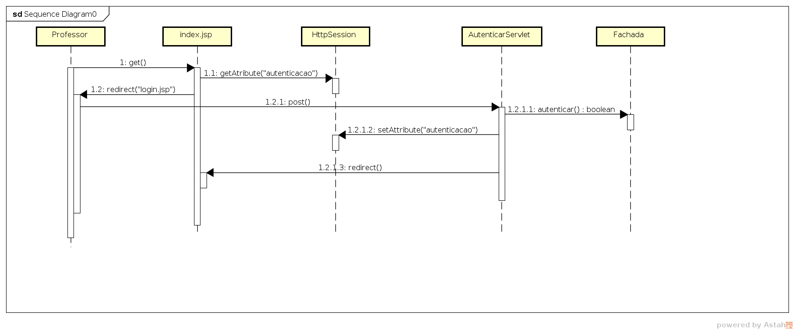

# Caso de Uso: Autenticação do professor

Este caso de uso descreve como o professor vai se autenticar: identificar-se para o sistema e autorizar ações restritas. A autenticação será feita com o SIAP (tipo de matrícula do professor) e uma senha escolhida pelo professor.

## Pré-requisitos

* O professor deve estar devidamente cadastrado no sistema

## Fluxo principal

* O professor acessa a URL do sistema
* O sistema o redireciona para o formulário de autenticação
* O professor preenche o formulário com SIAP e senha
* O professor envia o formulário pressionando o botão de envio do formulário
* O sistema verifica se a autenticação é válida e autentica-o
* O sistema redireciona o professor para uma página de índice

## Problemas que podem acontecer

### O professor errou a senha ou SIAP, ou ainda ele não está cadastrado

* O sistema redireciona o professor para o formulário de autenticação
* O sistema exibe uma mensagem avisando que a senha ou SIAP está errado e com instruções para solicitar um cadastro

## Páginas

### Formulário de autenticação

* O formulário tem dois campos: SIAP e Senha
* Os dois campos devem estar rotulado
* O campo SIAP só deve aceitar números (opcional)
* O campo senha deve esconder o caracteres da senha
* O formulário é enviado através de um botão com o rótulo "Autenticar"

### Mensagem de erro na Senha, SIAP ou falta de cadastro

* A mensagem deve estar antes do formulário
* A mensagem deve estar em vermelho e negrito
* O texto da mensagem deve ser:

> A senha e/ou número SIAP estão incorretos ou não foram cadastrados.
> Para cadastrar contate um administrador do sistema pelo email <email@dominio>.

## Diagrama de sequência

Esse diagrama não está perfeito, mas acho que dá para entender.

